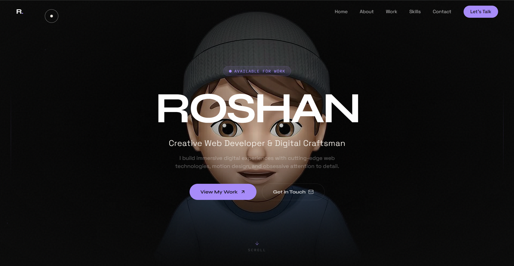

# 💎 Modern Interactive Portfolio v2



## 🚀 Overview
**Live Site**: [roshan-portfolio-ochre-tau.vercel.app](https://roshan-portfolio-ochre-tau.vercel.app/)

Welcome to my personal portfolio—a high-end, motion-focused digital experience designed to showcase my work as a Creative Web Developer and Digital Craftsman. This project blends cutting-edge web technologies with premium aesthetics to create an immersive storytelling journey.

## ✨ Key Features
- **Dynamic 3D Interactions**: Integrated high-fidelity 3D assets and motion-driven backgrounds.
- **Premium Glassmorphism**: High-end UI design with sophisticated backdrop blurs and subtle micro-animations.
- **Scroll-Linked Animations**: Interactive scroll experiences powered by Framer Motion.
- **Responsive & Optimized**: Fully responsive layout optimized for all screen sizes, from mobile to desktop.
- **Video Backgrounds**: High-performance video loops integrated into project previews.

## 🛠️ Tech Stack
- **Framework**: [Next.js 14+](https://nextjs.org/) (App Router)
- **Styling**: [Tailwind CSS](https://tailwindcss.com/)
- **Animations**: [Framer Motion](https://www.framer.com/motion/)
- **Icons**: [Lucide React](https://lucide.dev/)
- **Typography**: Font-family: 'Outfit', 'Inter'
- **Language**: [TypeScript](https://www.typescriptlang.org/)

## 📂 Featured Projects
1. **HeroVerse Archive**: A cinematic multiverse character database built with Java, JSP, and JDBC.
2. **Aroma Heaven Spa**: A serene, clean spa service website using HTML, CSS, JS, and PHP.
3. **Interactive Portfolio**: This very site—showcasing advanced React patterns and motion design.

## 🚀 Getting Started

First, install the dependencies:
```bash
npm install
```

Then, run the development server:
```bash
npm run dev
```

Open [http://localhost:3000](http://localhost:3000) with your browser to see the result.

## 📬 Let's Connect
Feel free to reach out for collaborations or just to say hi!

- **GitHub**: [Roshan3690](https://github.com/Roshan3690)
- **Email**: Check the contact section on the live site!

---
Designed and Developed with ❤️ by Roshan.
